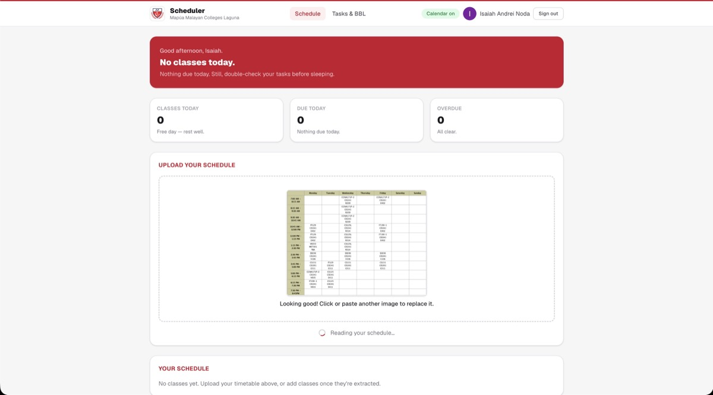
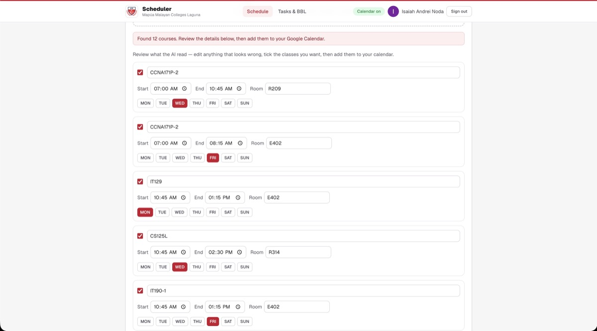
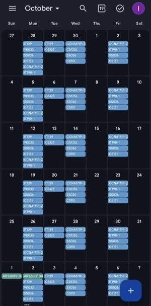

# Scheduler — Mapúa Malayan Colleges Laguna

A class schedule assistant made for students. Upload a photo of your timetable, the app reads it for you, and everything gets synced into Google Calendar as weekly recurring events. You also get a nightly reminder at 9:00 PM so you never walk into the wrong room — or forget a class entirely.

## How it works

1. **Sign in with Google** — the same account you use for your calendar.
2. **Upload your timetable** — a photo or screenshot works; you can also paste one in.
3. **Review what it read** — fix any mistakes before saving.
4. **Done** — your classes are in Google Calendar, and the app reminds you every night at 9:00 PM.

## Where it's live

**https://scheduler-google-something-idk-sikret.vercel.app**

Just sign in with Google and go. No installation, no fees.

## Screenshots

<p align="center">
  
</p>

<p align="center">
  
</p>

<p align="center">
  
</p>

## Why this is free

Everything runs on free tiers:

| Service | What it does |
| --- | --- |
| Vercel | Hosting + the nightly cron job |
| Neon | The database (Postgres) |
| Google Gemini | Reads your timetable photo |
| Google Calendar + Web Push | The syncing and the reminders |

No subscriptions, no hidden costs.

## Running it locally (for developers)

```bash
npm install
cp .env.example .env.local      # then fill in the keys
npm run dev                     # http://localhost:3000
```

The required keys are listed in `.env.example`. A local `dev.db` file is used as the database when developing, and Postgres takes over in production (same schema — see `prisma/schema.postgres.prisma`).

## Privacy

- Your schedule lives in your own Google Calendar and the app's database.
- The timetable photo is sent to Google Gemini only to read the text, then discarded.
- You can delete everything yourself: remove your classes in the app or hit **Calendar cleanup** to remove leftover events from your calendar.

Made with ❤️ at Mapúa Malayan Colleges Laguna.